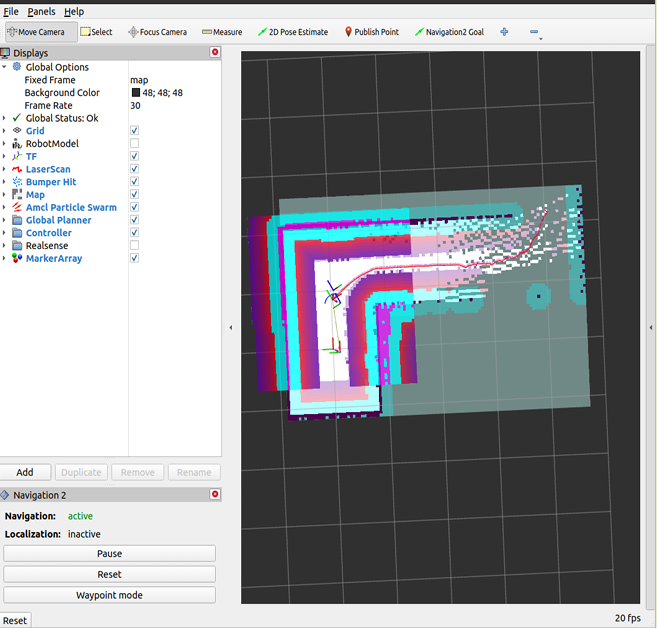
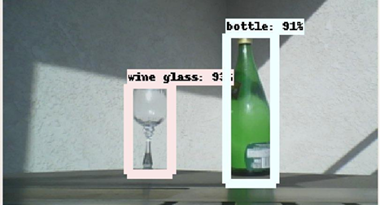

# Robotics Frameworks — Exercises 10–12

**Course:** Robotics Frameworks (RoF) · FAU Erlangen-Nuremberg
**Platform:** iRobot Create 3 / TurtleBot3 Waffle · ROS 2 Humble · Ubuntu 22.04

This repository contains the custom ROS 2 packages developed for Exercise Units 10–12, covering autonomous navigation, YOLO-based perception, and hierarchical state machine control using the FlexBE framework.

---

## Overview

The exercises integrate four subsystems into a single autonomous logistics workflow:

| Task | Topic | Key Technology |
|------|-------|----------------|
| 1 | iRobot Create 3 Familiarisation | ROS 2 topics, actions, `ros2 topic pub` |
| 2 | Autonomous Navigation | Nav2 stack (AMCL + DWB planner + SLAM Toolbox) |
| 3 | Object Detection | YOLO (transfer learning) + `yolo_msgs` |
| 4 | State Machine | FlexBE behaviours & states |

---

## Repository Structure

```
rof-exercises/
├── rof_flexbe_states/          # Custom FlexBE states (Task 4)
│   ├── drive2goal_state.py     #   Nav2 NavigateToPose action client
│   ├── find_object_state.py    #   YOLO detection subscriber
│   ├── drive_distance.py       #   Odometry-based distance driving
│   ├── stop_state.py           #   Velocity zeroing with odom verification
│   └── twist_state.py          #   Timed open-loop velocity command
├── rof_flexbe_behaviors/       # FlexBE behaviour (state machine definition)
│   └── move_jetbot_sm.py       #   Drive → Stop → Finish SM
├── rof_navigation/             # Nav2 configuration (Task 2)
│   ├── config/
│   │   ├── navigation_params.yaml   # AMCL, DWB, costmap, BT parameters
│   │   └── slam_params.yaml         # SLAM Toolbox parameters
│   └── launch/
│       ├── navigation_launch.py
│       └── slam_launch.py
└── docs/                       # Screenshots and TF tree snapshots from runtime
    ├── nav2_rviz.png               #   RViz2 — Nav2 active with costmaps and planned path
    └── yolo_detection.png          #   YOLO inference — bounding boxes with class/confidence
```

---

## Results

### Task 2 — Autonomous Navigation (Nav2)



RViz2 showing the active Nav2 stack: AMCL particle cloud for localisation, global and local costmaps built from lidar scan data, and the planned trajectory to the goal pose.

### Task 3 — Object Detection (YOLO)



YOLO inference running in the Gazebo simulation — detecting objects with class labels and confidence scores (e.g. `wine glass: 93%`, `bottle: 91%`).

---

## Custom FlexBE States

### `Drive2GoalState`
Wraps the Nav2 `NavigateToPose` action. Accepts a full 6-DOF pose (position + quaternion) and a reference frame, sends the goal on state entry, monitors `distance_remaining` feedback, and cancels automatically with a custom 0.3 m tolerance. Cancels the active goal cleanly on exit or behaviour stop.

### `FindObjectState`
Subscribes to a YOLO `DetectionArray` topic and searches for a specified `class_name` string. Returns `available` immediately on match, or `empty` after a configurable timeout. Uses `ProxySubscriberCached` to avoid redundant subscriptions across concurrent states.

### `DriveDistanceState`
Drives the robot a fixed Euclidean distance by comparing current odometry against the pose saved on state entry. Publishes a constant `Twist` until the distance threshold is met, then sends a zero command.

### `StopState`
Publishes zero velocity and verifies the robot has actually stopped by checking that the magnitude of `odom.twist` falls below a threshold within a configurable timeout.

### `TwistState`
Publishes a constant linear + angular velocity for a fixed duration (open-loop). Used as a simple fallback or demo primitive.

---

## Workspace Setup

Clone this repo into your `ros2_ws/src/` alongside the required external packages:

```bash
cd ~/ros2_ws/src

# This repository
git clone https://github.com/YOUR_USERNAME/rof-exercises-10-12.git

# Course simulation environment (FAU)
git clone https://git.faps.uni-erlangen.de/robotik-public/robotics-frameworks-exercises-25-26/rof_gazebo.git

# FlexBE framework
git clone https://github.com/FlexBE/flexbe_behavior_engine.git -b ros2-devel
git clone https://github.com/FlexBE/flexbe_app.git -b ros2-devel

# YOLO message definitions
git clone https://git.faps.uni-erlangen.de/heengelhardt/yolo_msgs.git

# Install ROS 2 dependencies and build
cd ~/ros2_ws
rosdep install --from-paths src --ignore-src -r -y
colcon build --symlink-install
source install/setup.bash
```

---

## Running the System

```bash
# 1. Launch the Gazebo simulation
ros2 launch rof_gazebo t3_simulation_faps.launch.py

# 2. Launch SLAM (for mapping) or Navigation (with existing map)
ros2 launch rof_navigation slam_launch.py
ros2 launch rof_navigation navigation_launch.py

# 3. Start FlexBE
ros2 launch flexbe_app flexbe_full.launch.py
```

---

## Tech Stack

- **ROS 2 Humble** — middleware, actions, topics, TF2
- **Nav2** — AMCL localisation, DWB local planner, BehaviorTree-based navigation
- **SLAM Toolbox** — online lidar SLAM for map building
- **FlexBE** — hierarchical finite state machine engine for robot behaviours
- **YOLO (Ultralytics)** — real-time object detection with transfer learning
- **Gazebo** — physics simulation (FAPS factory world)
